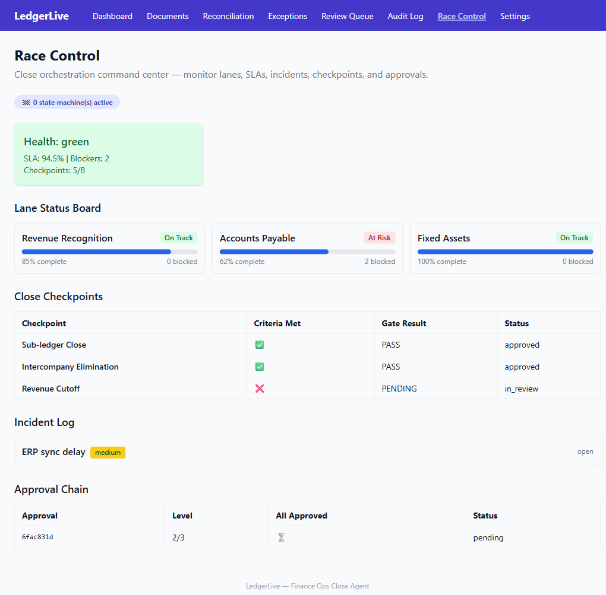
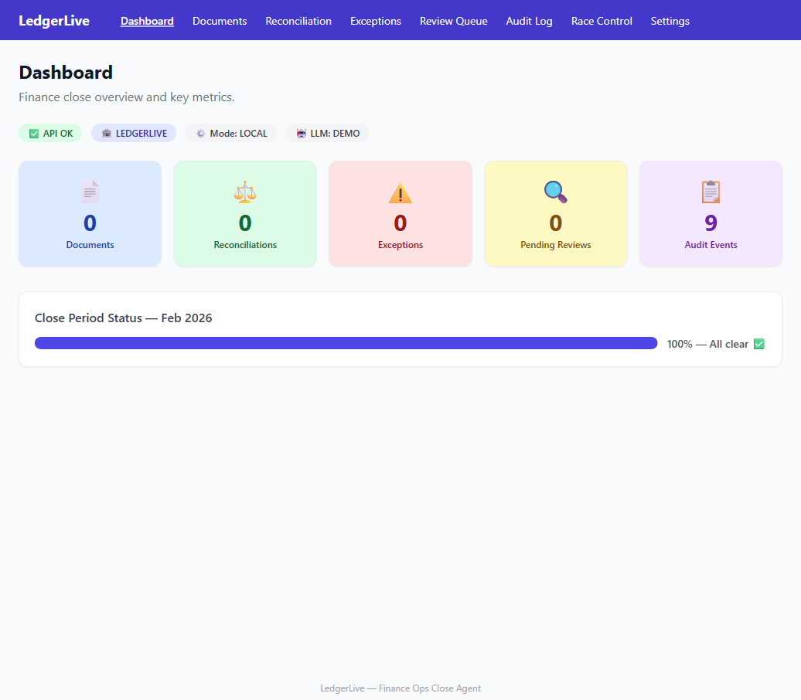
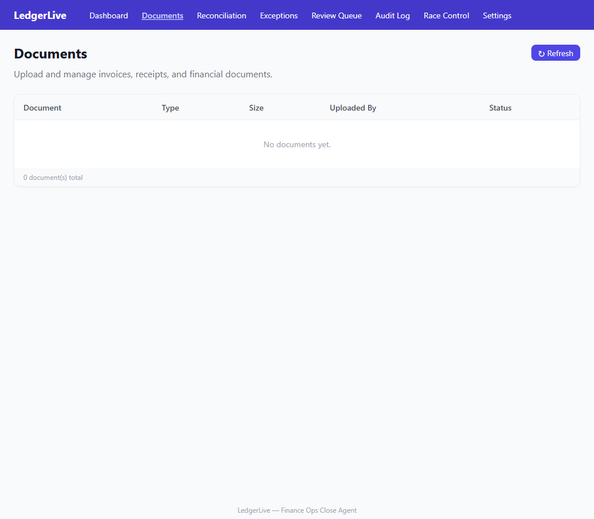
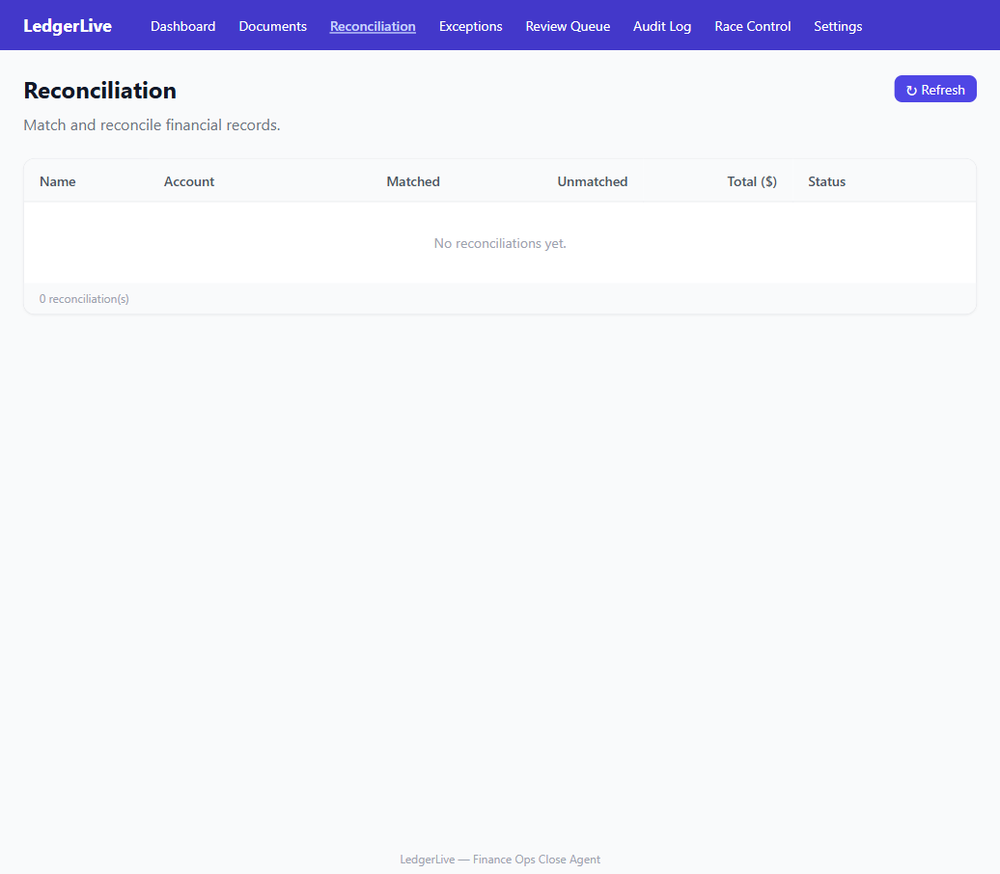
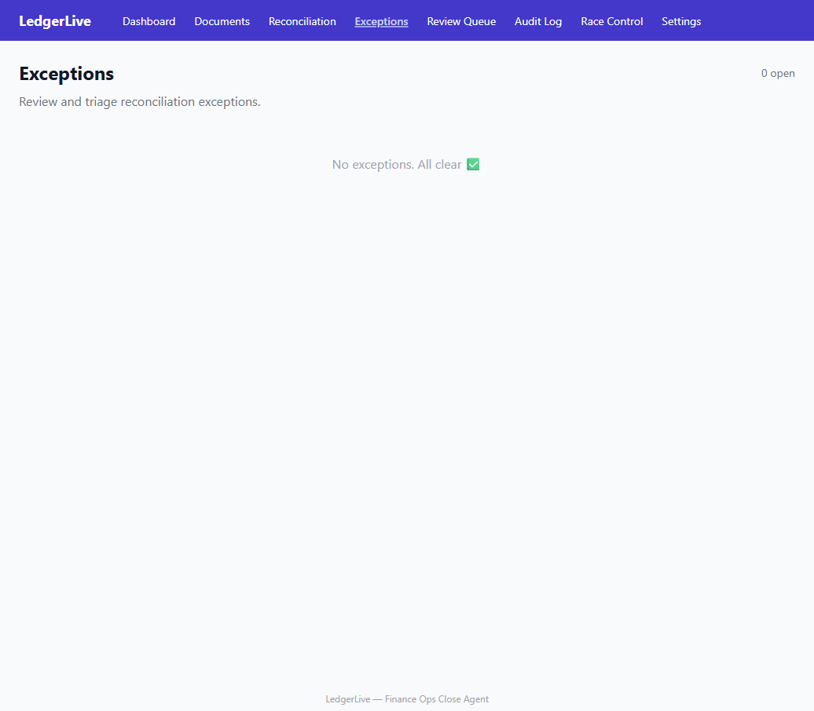
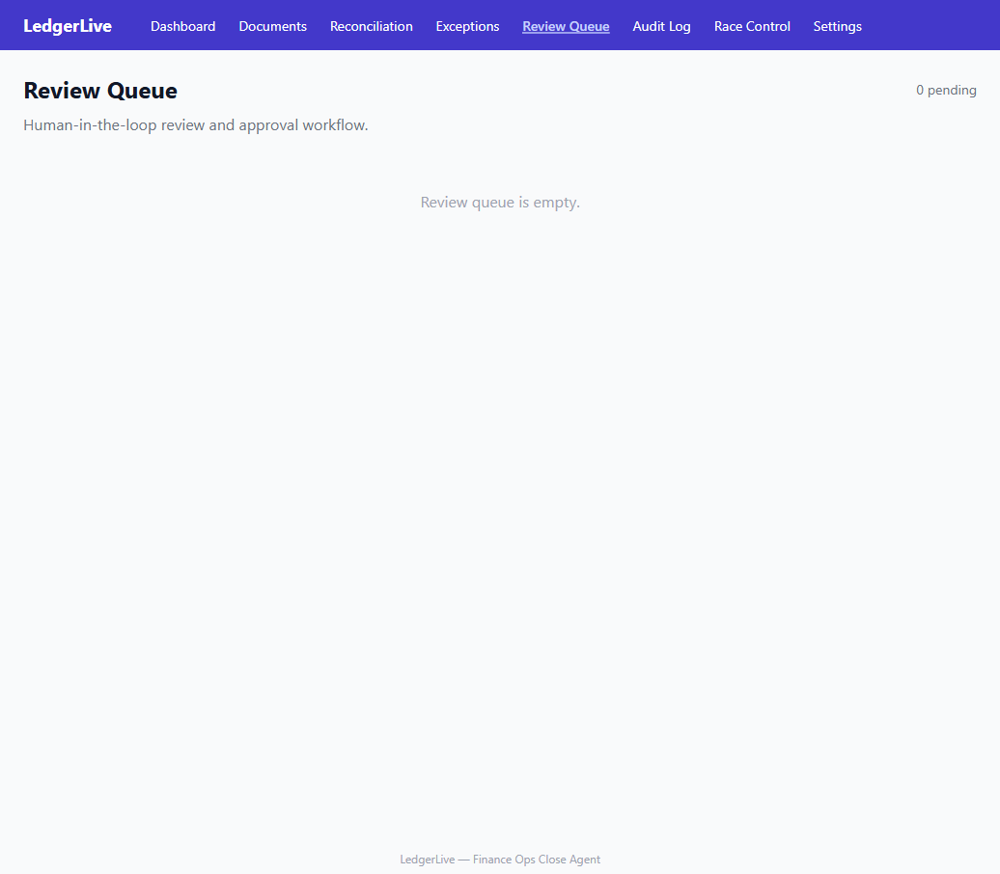
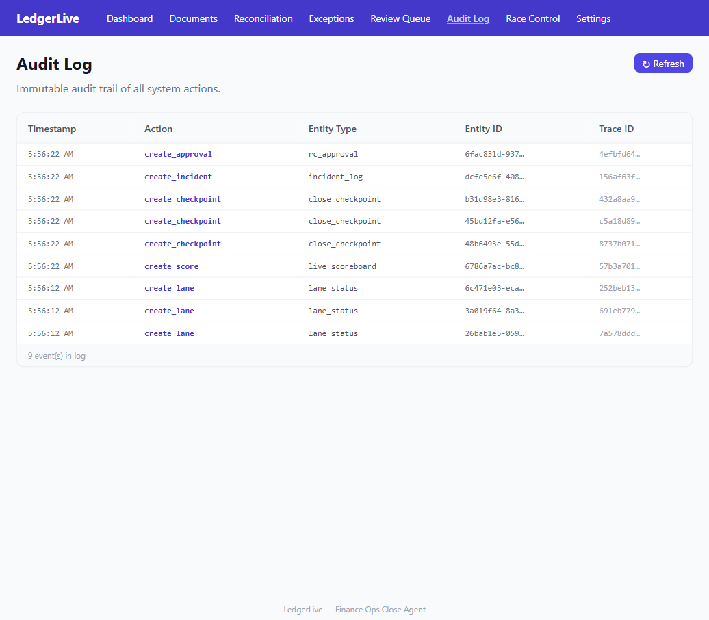
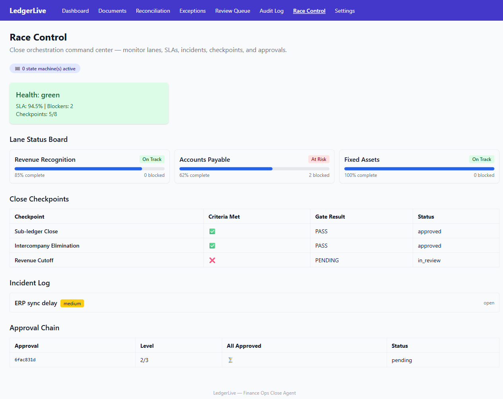
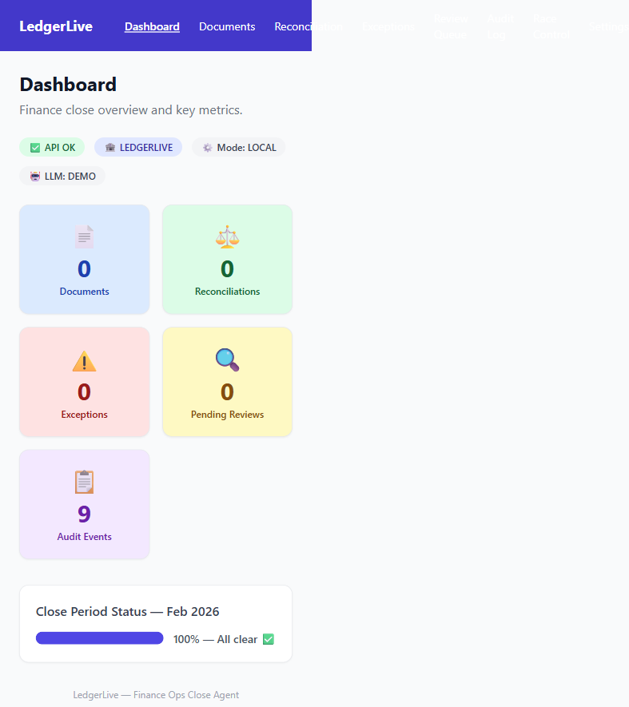
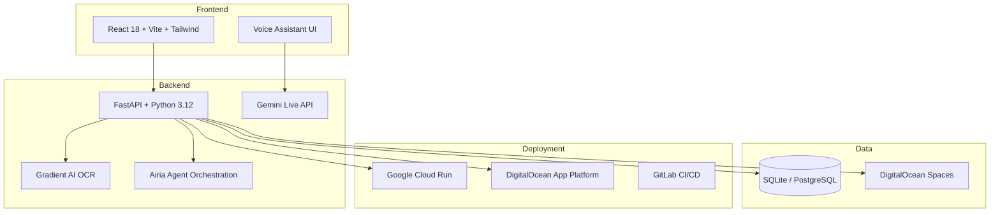

# LedgerLive -- AI Finance Close Agent

[](LICENSE)
[](https://python.org)
[](https://nodejs.org)
[](https://fastapi.tiangolo.com)
[](https://react.dev)
[]()

> **LedgerLive closes your books like a Williams F1 pit crew closes a race** -- every document ingested, every mismatch triaged, every decision explained, every artifact sealed.

Finance teams spend 40+ hours per quarter on manual close reconciliation, during which errors cost companies an average of $300K. LedgerLive automates the entire month-end close process with an AI agent that perceives financial data, decides on actions, acts autonomously on low-risk items, and escalates high-risk decisions to humans -- all with a complete audit trail.

## Screenshots


*Race Control: Live command center showing lanes, scoreboard, and incident tracking during a close cycle.*


*Dashboard: Pit Lane overview -- documents, OCR, reconciliations, and exceptions at a glance.*


*Document Ingestion: Upload and track PDFs, CSVs, and bank statements with auto-OCR status.*


*Reconciliation Engine: Bank-to-GL and subledger matching with AI-powered mismatch reasoning.*


*Exception Triage: AI-classified mismatches by severity, with auto-resolve for low-risk items.*


*Human-in-the-Loop Review: High-severity exceptions routed to approvers with full reasoning context.*


*Audit Trail: Every action, decision, and approval captured with tamper-evident hashing.*


*Incident Tracking: Real-time blocker and exception surfacing during an active close cycle.*


*Mobile: Responsive CFO dashboard for on-the-go close monitoring.*

## Features

- **Document Ingestion** -- Upload PDFs, CSVs, bank statements; auto-OCR with 94%+ confidence
- **Reconciliation Engine** -- Bank-to-GL, subledger-to-GL, vendor statement matching with AI reasoning
- **Exception Triage** -- AI classifies mismatches by severity and confidence; auto-resolves low-risk items
- **Human-in-the-Loop Review** -- High-severity exceptions routed to the right approver with full reasoning
- **Evidence Binder** -- Tamper-evident, SHA-256 sealed audit pack for compliance
- **Voice Assistant (Gemini)** -- Talk to your ledger in real-time using Gemini Live API
- **Race Control Dashboard** -- F1-inspired live command center for close cycle management
- **340+ Deterministic Service Waves** -- Comprehensive finance operations coverage
- **Multi-Agent Architecture** -- Specialized agents for ingestion, reconciliation, triage, and HITL
- **No-Code Builder Preview** -- Export workflows to Airia community bundles
- **Consolidation Engine** -- Intercompany elimination, FX translation, cashflow consolidation
- **FP&A Suite** -- Budgeting, forecasting, driver-based planning, scenario analysis

## Architecture



## Tech Stack

| Layer | Technology | Purpose |
|-------|-----------|---------|
| Backend | FastAPI + Python 3.12 | API server, business logic |
| Frontend | React 18 + Vite + Tailwind | SPA dashboard |
| Voice | Gemini Live API | Real-time voice interaction |
| OCR/AI | DigitalOcean Gradient AI | Document extraction |
| Orchestration | Airia Platform | Multi-agent workflows |
| Database | SQLite (dev) / PostgreSQL (prod) | Data persistence |
| Object Storage | DigitalOcean Spaces | Document and artifact storage |
| E2E Testing | Playwright (headed-only) | End-to-end verification |
| CI/CD | GitLab CI/CD | Automated build, test, deploy |
| Deployment | Docker + Cloud Run + App Platform | Containerized hosting |

## Quick Start

```bash
# Clone and start
git clone https://github.com/aaravjj2/ledgerlive.git
cd ledgerlive
cp .env.example .env
make demo

# Open Race Control
open http://127.0.0.1:4173/race-control
```

### Docker Quick Start

```bash
docker-compose up -d
open http://localhost:3000
```

### Prerequisites

- Python 3.12+
- Node.js 22+
- npm 10+

## Development

```bash
make dev          # Start API + web dev server with hot reload
make test         # Run 4,269+ backend tests
make e2e-mcp      # Run Playwright E2E headed tests
make lint         # Run all linters
make airia:bundle # Generate deterministic Airia community bundle
```

### Airia Community Bundle

```bash
make airia:bundle    # Generate deterministic bundle
make airia:validate  # Strict readiness check
make airia:verify    # Offline checksum verification
make airia:compat    # Run Airia Compatibility Report
```

Bundle output: `artifacts/airia/community_bundle/`

See [docs/airia/AIRIA_OVERVIEW.md](docs/airia/AIRIA_OVERVIEW.md) for full details.

## Hackathon Submissions

LedgerLive is submitted to 4 hackathons simultaneously:

| Hackathon | Prize Pool | Deadline | Angle |
|-----------|-----------|----------|-------|
| [Gemini Live Agent Challenge](https://geminiliveagentchallenge.devpost.com/) | $80,000 | Mar 16, 2026 | Voice-enabled finance assistant using Gemini Live API for real-time conversational close management |
| [DigitalOcean Gradient AI](https://digitalocean.devpost.com/) | $20,000 | Mar 18, 2026 | Cloud-native AI finance ops with Gradient AI OCR and DigitalOcean Spaces |
| [Airia AI Agents](https://airia-hackathon.devpost.com/) | $7,000 | Mar 19, 2026 | Enterprise multi-agent close team with no-code blueprint builder and community bundles |
| [GitLab AI Hackathon](https://gitlab.devpost.com/) | $65,000 | Mar 25, 2026 | AI-accelerated compliance DevOps with CI/CD gates, proof packs, and deterministic verification |

Per-hackathon submission assets live in `hackathons/gemini/`, `hackathons/digitalocean/`, `hackathons/airia/`, and `hackathons/gitlab/`.

## F1 Glossary

The entire product uses an F1 racing metaphor to make the finance close process intuitive and visual.

| F1 Term | Finance Reality |
|---------|-----------------|
| Race Control | Close Command Center |
| Pit Stops | Close Checkpoints |
| Laps | Close Stages / Milestones |
| Telemetry | Audit Trail + Drift Budgets |
| Safety Car | Fail-Closed + Approvals Required |
| Pit Wall | Approver Chain + SLA Escalations |
| Incident Log | Exceptions / Blockers / Policy Events |
| Court Pack | Stewards Evidence Package |
| DRS Zone | Fast-path Auto-approval |

**Why racing fits:** Pit stops are timed checkpoints; a slow reconciliation is a slow pit stop visible in lap delta. Telemetry is the audit trail; every tool call emits traces; the court pack is the stewards' evidence. Safety Car pauses automation for approvals -- fail-closed until the pit wall gives all-clear.

## Project Structure

```
ledgerlive/
├── apps/
│   ├── api/                # FastAPI backend (340+ wave routers)
│   │   ├── app/
│   │   │   ├── routers/    # API route handlers (w01 - w340)
│   │   │   ├── services/   # Business logic layer
│   │   │   ├── models/     # Pydantic models
│   │   │   ├── mcp/        # MCP server registry
│   │   │   ├── golden/     # Golden baseline verification
│   │   │   └── main.py     # FastAPI entry point
│   │   └── tests/          # 4,269+ pytest tests
│   └── web/                # React frontend
│       ├── src/
│       │   ├── components/   # 20+ reusable components
│       │   ├── hooks/        # 87+ custom hooks
│       │   └── pages/        # 113+ page components
│       └── e2e/              # Playwright E2E specs
├── hackathons/             # Per-hackathon submission assets
│   ├── gemini/             # Gemini Live Agent Challenge
│   ├── digitalocean/       # DigitalOcean Gradient AI
│   ├── airia/              # Airia AI Agents
│   └── gitlab/             # GitLab AI Hackathon
├── artifacts/              # Generated artifacts and screenshots
├── docs/                   # Documentation
│   ├── airia/              # Airia integration docs
│   ├── architecture/       # System design docs
│   └── features/           # Feature documentation
├── tools/                  # Build, deploy, and gate tooling
├── docker-compose.yml      # Full-stack Docker setup
├── Makefile                # Task runner
└── Procfile                # Process manager config
```

## Gates

LedgerLive enforces deterministic correctness through automated gates:

- **No Apex References** -- `tools/gates/no_apex_references.py` ensures zero Apex Terminal references
- **No Network in Tests** -- `tools/gates/no_network_in_tests.py` blocks outbound network calls in tests
- **Golden Binder SHA-256** -- `app/golden/baselines/golden_binder_sha256.txt` verifies artifact integrity
- **Route Coverage Gate** -- Every API route must have a corresponding test
- **Determinism Harness** -- Repeated runs produce identical outputs

## Roadmap

- [ ] Real-time collaborative close cycles
- [ ] Mobile-responsive CFO dashboard
- [ ] Multi-currency reconciliation engine
- [ ] Regulatory compliance templates (SOX, IFRS)
- [ ] Integration marketplace (QuickBooks, Xero, Plaid)
- [ ] AI-powered anomaly detection with trend analysis

## License

[MIT](LICENSE) -- see the LICENSE file for details.

## Contributing

See [CONTRIBUTING.md](CONTRIBUTING.md) for guidelines.
