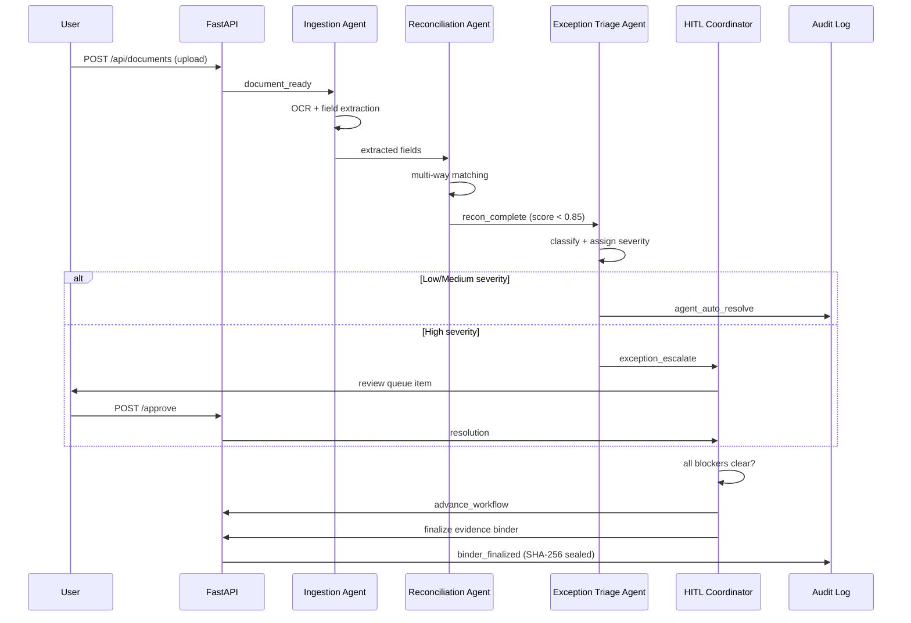

# Agent Architecture

> LedgerLive uses a multi-agent system built on a Perceive-Decide-Act loop.
> This document explains the architecture, agent responsibilities, and message contracts.

---

## System Overview

The agent system operates as an autonomous close engine. Instead of a monolithic controller, four specialized agents collaborate through shared state and a central message bus. Each agent cycle produces a full decision trace for auditability.

---

## The Four Agents

### 1. Ingestion Agent

**Responsibility**: Document intake, OCR pipeline orchestration, field extraction.

- Watches for new documents in the document store.
- Submits them to the OCR pipeline and monitors job completion.
- Extracts structured fields (amounts, dates, references) from OCR output.
- Emits `document_ready` messages when extraction is complete.

### 2. Reconciliation Agent

**Responsibility**: Multi-way matching and scoring.

- Consumes `document_ready` messages.
- Runs bank-to-GL, subledger-to-GL, and vendor statement reconciliations.
- Produces scored match results with human-readable explanations.
- Emits `recon_complete` with match scores for downstream processing.

### 3. Exception Triage Agent

**Responsibility**: Classification, severity assignment, auto-resolution.

- Consumes `recon_complete` messages for matches below the approval threshold.
- Classifies exceptions by category (timing, duplicate, mismatch, missing).
- Assigns severity (low, medium, high).
- Auto-resolves low and medium items with confidence scoring.
- Escalates high-severity items to the HITL Coordinator.

### 4. HITL Coordinator

**Responsibility**: Human-in-the-loop routing, workflow orchestration, binder generation.

- Routes escalated exceptions to the correct reviewer in the review queue.
- Monitors resolution status across all open items.
- Advances the close workflow when all blockers clear.
- Triggers evidence binder assembly and finalization.

---

## Perceive-Decide-Act Loop

Every agent cycle follows the same three-phase structure:

### Perceive

Read current state from all live services:

- Document counts and statuses
- OCR pipeline completion rates
- Reconciliation scores and approval status
- Open, escalated, and resolved exception counts
- Workflow progress (current step, active/completed counts)

### Decide

Apply rule-based triage with confidence scoring:

- **Auto-resolve**: Low-severity exceptions (95% confidence), medium with confidence > 70%.
- **Escalate**: High-severity exceptions to the review queue.
- **Advance workflow**: When all blocking exceptions are resolved.
- **Notify**: Post cycle results to the Airia webhook.

Each decision includes a reasoning trace and citations linking back to source data.

### Act

Execute the planned actions against live service stores:

- Resolve exceptions via the exception service.
- Assign and escalate items via the review queue.
- Advance workflow stages via the workflow service.
- Post webhook notifications to Airia.

Every action emits an audit event. Failed actions are logged but do not halt the cycle.

---

## Message Contracts Between Agents

```
Ingestion Agent                Reconciliation Agent
     |                               |
     |-- document_ready ------------>|
     |   { doc_id, fields,           |
     |     extraction_confidence }   |
     |                               |
     |                               |-- recon_complete -------> Exception Triage Agent
     |                               |   { recon_id, score,            |
     |                               |     source, target,             |
     |                               |     explanation }               |
     |                                                                 |
     |                                      exception_escalate ------->| HITL Coordinator
     |                                      { exc_id, severity,        |
     |                                        category, reasoning }    |
     |                                                                 |
     |<------------------ workflow_advance ----------------------------|
     |   { workflow_id, next_step }                                    |
```

---

## Sequence Diagram



---

## 340+ Deterministic Service Waves

Each service wave (w01 through w340) is a self-contained domain module with:

- A **router** (FastAPI endpoints) in `app/routers/`.
- A **service** (domain logic) in `app/services/`.
- A **test** in `tests/`.

Waves are numbered sequentially and registered in `app/main.py`. This architecture ensures that every endpoint is deterministic, testable in isolation, and traceable to a specific domain concern.

Key wave groups:

| Waves | Domain |
|-------|--------|
| w01-w10 | Core close (periods, entities, documents, OCR, recon, exceptions, review, binder) |
| w11-w30 | Platform (auth, tenants, workflows, connectors, compliance, performance) |
| w31-w60 | Finance features (consolidation, JE posting, budgeting, FP&A, treasury) |
| w061-w100 | Quality gates (E2E suites, determinism, regression, marketplace) |
| w101-w160 | Compliance, data, access control, reliability, performance, release |
| w161-w220 | Agent runtime, ML, connectors, replay, deployment |
| w221-w300 | Race control, orchestration, security, channels, finance ops proofs |
| w301-w340 | Blueprint builder, Atlassian integration, Airia readiness, final gates |

---

## Airia Integration

LedgerLive integrates with the Airia platform for agent orchestration:

- **MCP Tools**: 8 tools exposed via the Model Context Protocol for Airia to invoke.
- **Webhook Delivery**: Agent cycle results are posted to the configured Airia webhook URL.
- **Compatibility Report**: `GET /api/airia/compat_report` returns a 10-check compatibility assessment.
- **Bundle Export**: The Airia bundle packages the agent's configuration for one-click deployment on the Airia marketplace.
