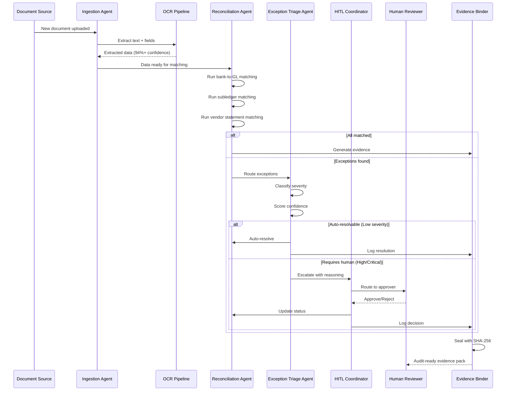

# LedgerLive — Agent Workflow

```mermaid
sequenceDiagram
    participant DOC as Document Source
    participant ING as Ingestion Agent
    participant OCR as OCR Pipeline
    participant REC as Reconciliation Agent
    participant TRI as Exception Triage Agent
    participant HITL as HITL Coordinator
    participant USER as Human Reviewer
    participant BIND as Evidence Binder

    DOC->>ING: New document uploaded
    ING->>OCR: Extract text + fields
    OCR-->>ING: Extracted data (94%+ confidence)
    ING->>REC: Data ready for matching

    REC->>REC: Run bank-to-GL matching
    REC->>REC: Run subledger matching
    REC->>REC: Run vendor statement matching

    alt All matched
        REC->>BIND: Generate evidence
    else Exceptions found
        REC->>TRI: Route exceptions
        TRI->>TRI: Classify severity
        TRI->>TRI: Score confidence

        alt Auto-resolvable (Low severity)
            TRI->>REC: Auto-resolve
            TRI->>BIND: Log resolution
        else Requires human (High/Critical)
            TRI->>HITL: Escalate with reasoning
            HITL->>USER: Route to approver
            USER-->>HITL: Approve/Reject
            HITL->>REC: Update status
            HITL->>BIND: Log decision
        end
    end

    BIND->>BIND: Seal with SHA-256
    BIND-->>USER: Audit-ready evidence pack
```
