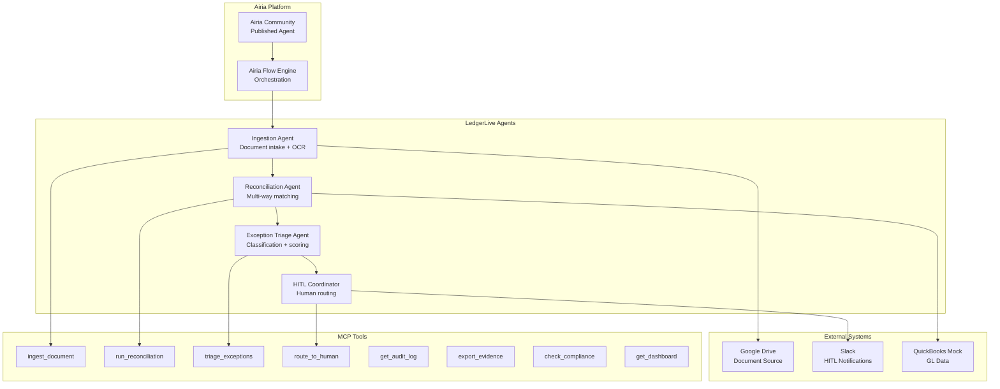

# LedgerLive — Airia Multi-Agent Architecture

```mermaid
graph TB
    subgraph "Airia Platform"
        FLOW["Airia Flow Engine<br/>Orchestration"]
        COMM["Airia Community<br/>Published Agent"]
    end

    subgraph "LedgerLive Agents"
        ING["Ingestion Agent<br/>Document intake + OCR"]
        REC["Reconciliation Agent<br/>Multi-way matching"]
        TRI["Exception Triage Agent<br/>Classification + scoring"]
        HITL["HITL Coordinator<br/>Human routing"]
    end

    subgraph "External Systems"
        GDRIVE["Google Drive<br/>Document Source"]
        SLACK["Slack<br/>HITL Notifications"]
        QBO["QuickBooks Mock<br/>GL Data"]
    end

    subgraph "MCP Tools"
        T1["ingest_document"]
        T2["run_reconciliation"]
        T3["triage_exceptions"]
        T4["route_to_human"]
        T5["get_audit_log"]
        T6["export_evidence"]
        T7["check_compliance"]
        T8["get_dashboard"]
    end

    FLOW --> ING
    ING --> REC
    REC --> TRI
    TRI --> HITL

    ING --> GDRIVE
    HITL --> SLACK
    REC --> QBO

    ING --> T1
    REC --> T2
    TRI --> T3
    HITL --> T4

    COMM --> FLOW
```
