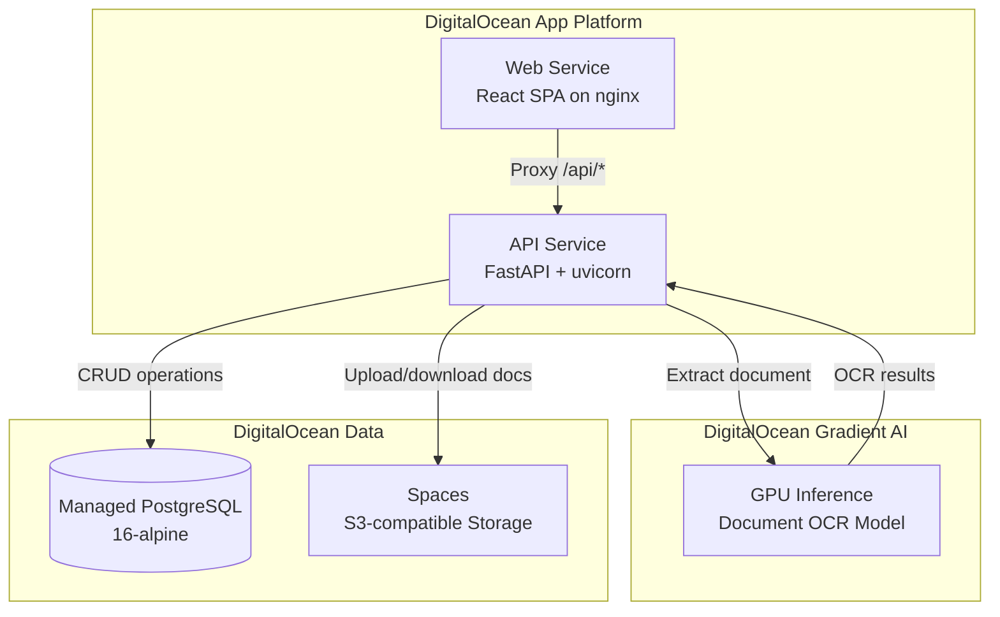

# LedgerLive — DigitalOcean Architecture

```mermaid
graph TB
    subgraph "DigitalOcean App Platform"
        WEB["Web Service<br/>React SPA on nginx"]
        API["API Service<br/>FastAPI + uvicorn"]
    end

    subgraph "DigitalOcean Gradient AI"
        GPU["GPU Inference<br/>Document OCR Model"]
    end

    subgraph "DigitalOcean Data"
        PG[("Managed PostgreSQL<br/>16-alpine")]
        SPACES["Spaces<br/>S3-compatible Storage"]
    end

    WEB -->|"Proxy /api/*"| API
    API -->|"Extract document"| GPU
    API -->|"CRUD operations"| PG
    API -->|"Upload/download docs"| SPACES
    GPU -->|"OCR results"| API
```
