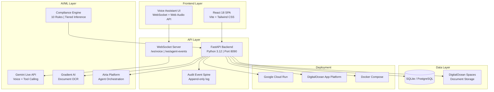

# LedgerLive — Full System Architecture

## Component Details

| Component | Technology | Purpose |
|-----------|-----------|---------|
| Frontend | React 18 + Vite + Tailwind | SPA dashboard with 113+ pages |
| Voice UI | Web Audio API + WebSocket | Real-time audio capture/playback |
| Backend API | FastAPI (340+ wave routers) | Business logic + API endpoints |
| Gemini Live | Google GenAI SDK | Voice interaction + tool calling |
| Gradient AI | DigitalOcean API | GPU-backed document OCR |
| Airia | MCP Tools + Webhooks | Multi-agent orchestration |
| Compliance | Regex + Claude/Gemini | GitLab MR compliance checking |
| Database | SQLite (dev) / PostgreSQL (prod) | Transaction/document storage |
| Spaces | S3-compatible object storage | Document file storage |
