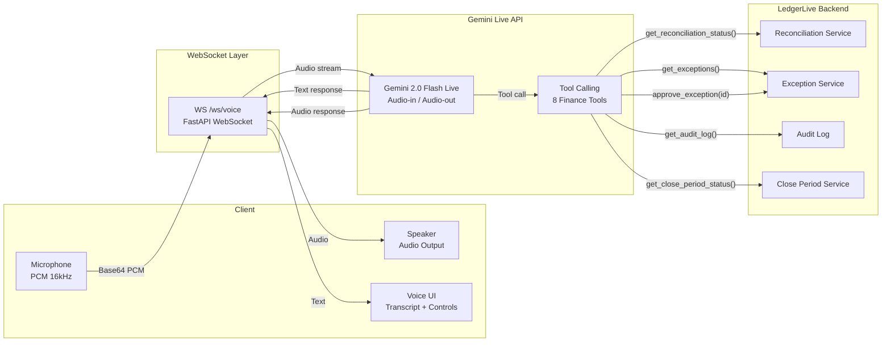

# LedgerLive — Gemini Live API Architecture

```mermaid
graph LR
    subgraph "Client"
        MIC["Microphone<br/>PCM 16kHz"]
        SPEAKER["Speaker<br/>Audio Output"]
        UI["Voice UI<br/>Transcript + Controls"]
    end

    subgraph "WebSocket Layer"
        WS["WS /ws/voice<br/>FastAPI WebSocket"]
    end

    subgraph "Gemini Live API"
        LIVE["Gemini 2.0 Flash Live<br/>Audio-in / Audio-out"]
        TOOLS["Tool Calling<br/>8 Finance Tools"]
    end

    subgraph "LedgerLive Backend"
        RECON["Reconciliation Service"]
        EXC["Exception Service"]
        AUDIT["Audit Log"]
        CLOSE["Close Period Service"]
    end

    MIC -->|"Base64 PCM"| WS
    WS -->|"Audio stream"| LIVE
    LIVE -->|"Text response"| WS
    LIVE -->|"Audio response"| WS
    LIVE -->|"Tool call"| TOOLS
    TOOLS -->|"get_exceptions()"| EXC
    TOOLS -->|"get_reconciliation_status()"| RECON
    TOOLS -->|"approve_exception(id)"| EXC
    TOOLS -->|"get_audit_log()"| AUDIT
    TOOLS -->|"get_close_period_status()"| CLOSE
    WS -->|"Text"| UI
    WS -->|"Audio"| SPEAKER
```
