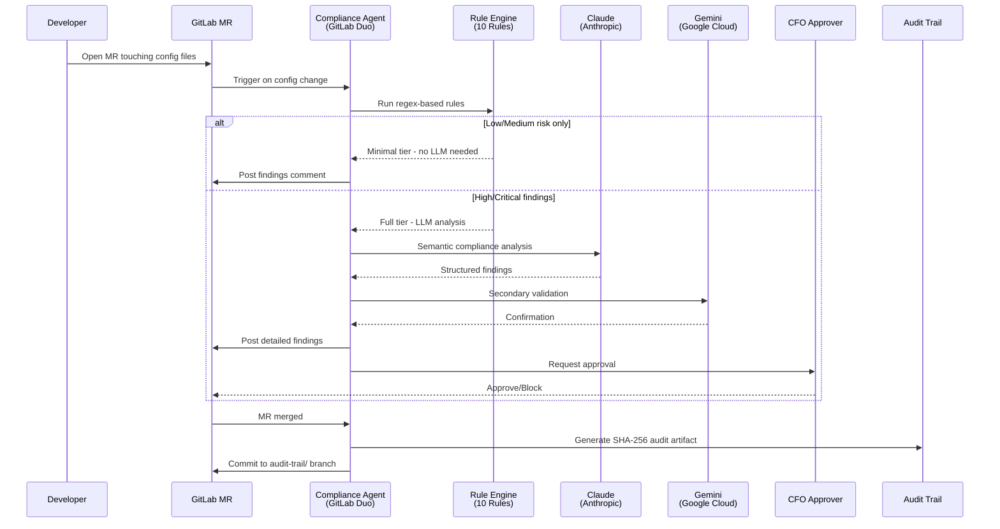

# LedgerLive — GitLab Duo Agent Architecture

```mermaid
sequenceDiagram
    participant DEV as Developer
    participant GL as GitLab MR
    participant AGENT as Compliance Agent<br/>(GitLab Duo)
    participant RULES as Rule Engine<br/>(10 Rules)
    participant CLAUDE as Claude<br/>(Anthropic)
    participant GEMINI as Gemini<br/>(Google Cloud)
    participant CFO as CFO Approver
    participant TRAIL as Audit Trail

    DEV->>GL: Open MR touching config files
    GL->>AGENT: Trigger on config change
    AGENT->>RULES: Run regex-based rules

    alt Low/Medium risk only
        RULES-->>AGENT: Minimal tier - no LLM needed
        AGENT->>GL: Post findings comment
    else High/Critical findings
        RULES-->>AGENT: Full tier - LLM analysis
        AGENT->>CLAUDE: Semantic compliance analysis
        CLAUDE-->>AGENT: Structured findings
        AGENT->>GEMINI: Secondary validation
        GEMINI-->>AGENT: Confirmation
        AGENT->>GL: Post detailed findings
        AGENT->>CFO: Request approval
        CFO-->>GL: Approve/Block
    end

    GL->>AGENT: MR merged
    AGENT->>TRAIL: Generate SHA-256 audit artifact
    AGENT->>GL: Commit to audit-trail/ branch
```
